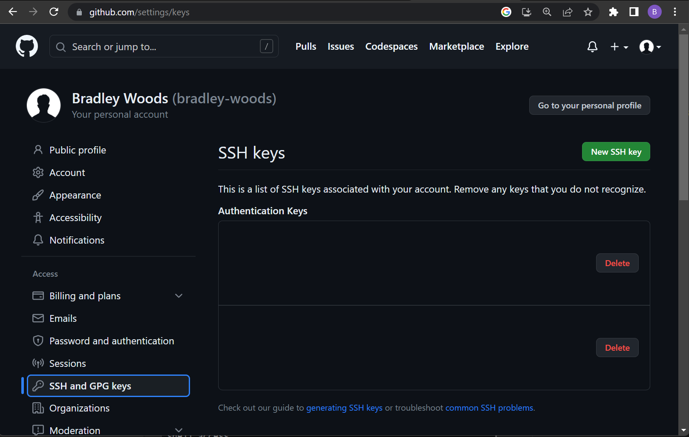
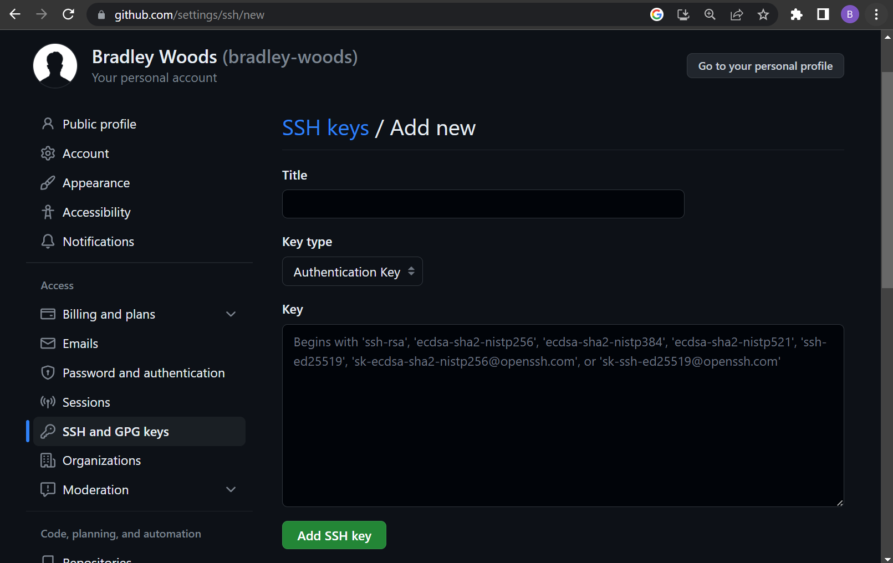
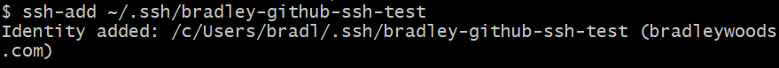
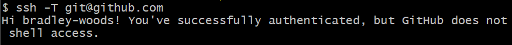
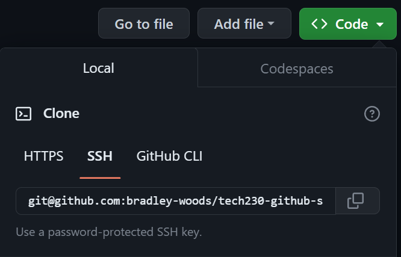

# GitHub SSH Connection

In this guide, we will be looking at how to set up a Secure Shell (SSH) connection between local Git and remote GitHub repositories.

1. First, open a Git bash terminal window and locate your .ssh hidden folder in your user folder using the following command:

    ```console
    $ cd ~/.ssh
    ```

    Alternatively, if you do not have an .ssh folder you can make one and open it with the below commands:

    ```console
    $ mkdir ~/.ssh
    $ cd ~/.ssh
    ```

2. Secondly, once inside the .ssh directory, generate the set of SSH keys using the following command. Use your own email here, preferably the one associated with your GitHub account:

    ```console
    $ ssh-keygen -t rsa -b 4096 -C "user@mail.com"
    ```

    > **Note:** -t represents the type of SSH key and -b represents the size, here it is RSA-4096, a commonly used encryption algorithm.

3. You will then be prompted to enter a passphrase, make sure to remember this if you enter one, or leave it blank if you prefer not to have one. Then, you will be asked to enter a name for the keys, in this case they are called 'bradley-github-ssh-test'.

    

    As shown above, you will now have generated your public key which acts as the lock and a private key for such lock. **Please DO NOT share the private key!**

4. Now we have generated the public and private keys in our .ssh folder, we need to add our public key to our GitHub account. Login to GitHub and go to 'Settings' > 'SSH and GPG keys'. Then click on the green 'New SSH key' button as shown below:

    

    Next, enter the key information such as the name you entered previously, select "Authentication Key" for Key type and then copy and paste your **public key** exactly in the last entry field as shown below:

    

    > **Note:** you can view your key in the terminal window by entering `cat <key-name>.pub` inside the .ssh directory.

5. Next, enter the following command to access the SSH key manager:

    ```console
    $ eval "$(ssh-agent -s)"
    ```

    > **Note:** similar to a real key chain it holds your keys and certificates, meaning you do not have to enter your passphrase every time you connect to a server.

6. Now add your key to the ssh-agent using the following command:

    ```console
    $ ssh-add ~/.ssh/<key-name>
    ```

    

7. To test the connection to GitHub was successful use the following command:

    ```console
    $ ssh -T git@github.com
    ```

    

8. Finally, if you have a repository on GitHub you want to clone to your local system you can use the following command using the SSH option in GitHub as shown below:

    ```console
    $ git clone git@github.com:<user>/<repo_name>.git
    ```

    

    Alternatively, if you want to add a local repository to your GitHub, you can use the following command:

    ```console
    $ git remote add origin git@github.com:<user>/<repo_name>.git
    ```
